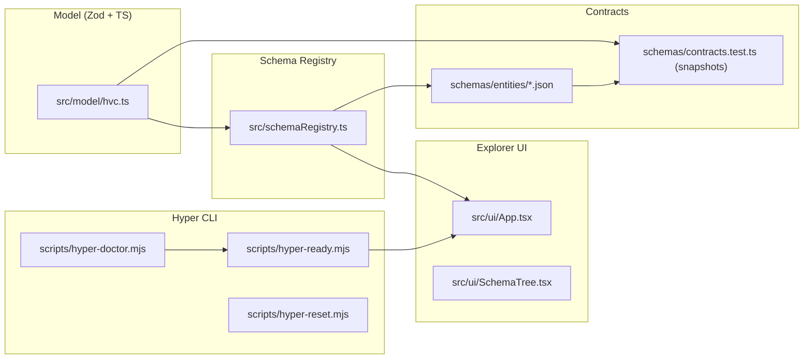
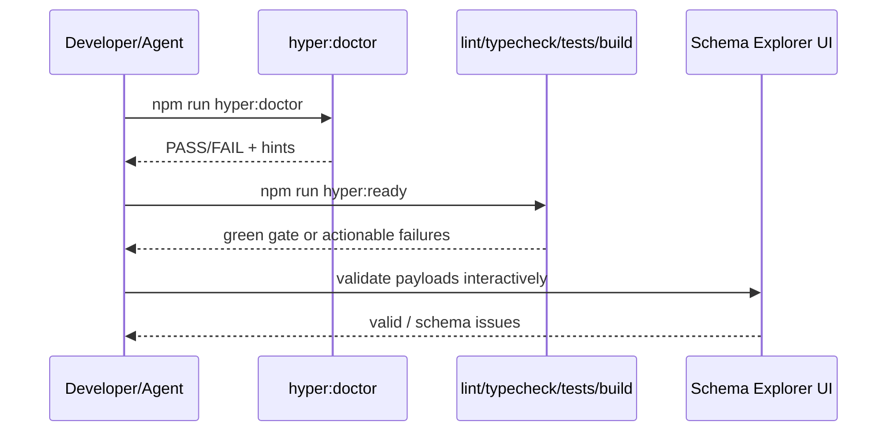

# Diagrams

## System Overview

```mermaid
flowchart LR
  subgraph Model["Model (Zod + TS)"]
    HVC["src/model/hvc.ts"]
  end

  subgraph Registry["Schema Registry"]
    REG["src/schemaRegistry.ts"]
  end

  subgraph UI["Explorer UI"]
    APP["src/ui/App.tsx"]
    TREE["src/ui/SchemaTree.tsx"]
  end

  subgraph Contracts["Contracts"]
    JSONS["schemas/entities/*.json"]
    SNAP["schemas/contracts.test.ts (snapshots)"]
  end

  subgraph CLI["Hyper CLI"]
    DOC["scripts/hyper-doctor.mjs"]
    READY["scripts/hyper-ready.mjs"]
    RESET["scripts/hyper-reset.mjs"]
  end

  HVC --> REG
  REG --> APP
  REG --> JSONS
  HVC --> SNAP
  JSONS --> SNAP
  DOC --> READY
  READY --> APP
```

## Developer Loop

```mermaid
sequenceDiagram
  participant Dev as Developer/Agent
  participant Doctor as hyper:doctor
  participant Gates as lint/typecheck/tests/build
  participant UI as Schema Explorer UI

  Dev->>Doctor: npm run hyper:doctor
  Doctor-->>Dev: PASS/FAIL + hints
  Dev->>Gates: npm run hyper:ready
  Gates-->>Dev: green gate or actionable failures
  Dev->>UI: validate payloads interactively
  UI-->>Dev: valid / schema issues
```

